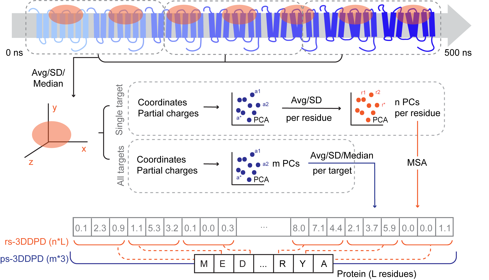

3D-Dynamic Protein Descriptors: 3DDPDs
======================================

This repository can be used to generate **3D dynamic protein descriptors (3DDPDs)**, as first developed by Marina Gorostiola González et. al [1]. 3DDPDs were developed to be able to account for protein dynamics in bioactivity prediction Proteochemometric (PCM) models. However, these dynamic protein descriptors can be applied in other fields where vectorization of protein dynamic behavior may be of interest. In general terms, the process of 3DDPD genereation can be visualized below. 



The repository contains a pip-installable package ([md_3ddpd](./src/md_3ddpd)) and a non-pip-installable package ([modelling](./src/modelling)). The modelling package was developed to benchmark in PCM the performance of 3DDPDs and produce the results and conclusions shown in [1], which were generated with [this code](./manuscript). On the other hand, the `md_3ddpd` package includes al neeed code to analyze MD trajectories and generate 3DDPDs from them. 

**NOTE:** In its current version, the `md_3ddpd` package is optimized for its application in G protein-coupled receptors (GPCRs), as the GPCRmd database [2] provides a very good resource of expert curated MD simulations. This is particularly relevant for the files accepted as input and for the binding pocket selection and MD analysis modules, that feed largely from the GPCRdb knwoledge database [3].


Quick Start
===========

### Installation
The `md_3ddpd` package can be installed with pip like so (with python >= 3.8.0):
```bash
pip install md_3ddpd
```

To install the whole repository and have access also to the modelling package, just clone the repository like so:
```bash
git clone git+https://gitlab.services.universiteitleiden.nl/cdd/3DDPD.git@main
```

### Use
After installation of the python `md_3ddpd` package, you will have access to the code needed to generate 3DDPDs from MD trajectories. For a quick start, you can check out our [Jupyter notebook tutorial](./tutorial), which documents the process of obtaining GPCR MD trajectories from GPCRmd [2], their analysis, and computation of different flavors of 3DDPDs. 


Authors and acknowledgment
==========================
* Marina Gorostiola González
* Remco van den Broek 

### Contributions
In its current version, the `md_3ddpd` package is optimized for its application in G protein-coupled receptors (GPCRs), as the GPCRmd database [2] provides a very good resource of expert curated MD simulations. This is particularly relevant for the files accepted as input and for the binding pocket selection and MD analysis modules, that feed largely from the GPCRdb knwoledge database [3]. Any contributions to further expand the code to all protein families are welcome and appreciated. 

### References
1. Gorostiola González M *et al. Manuscript in preparation*
2. Rodriguez-Espigares I *et al. Nature Methods* (2020)
3. Iberg V *et al. Nucleic Acids Research* (2016) 

